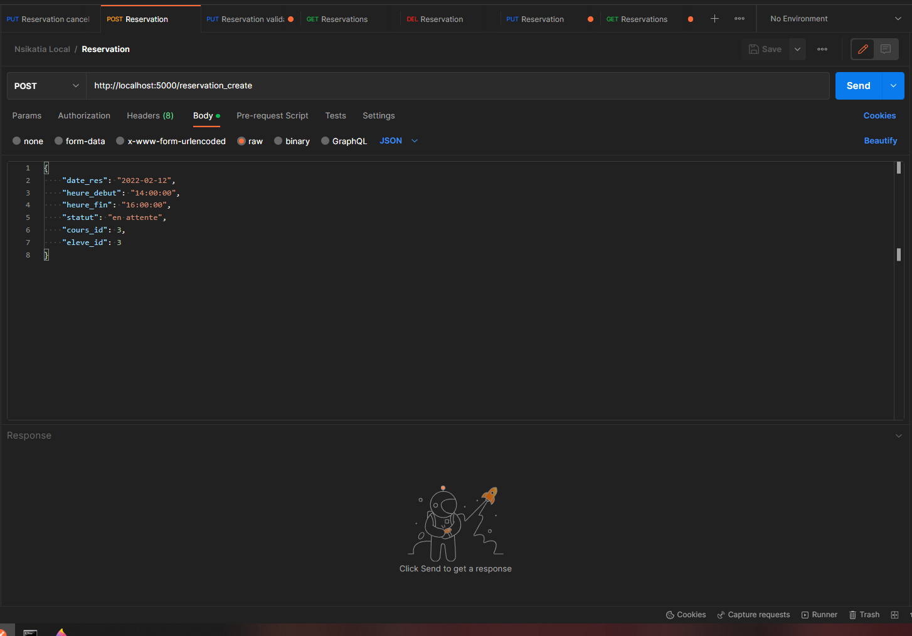

# NSIKATIA-LEADER BACK Project

Welcome to the Nsikatia-Leader Project ! 😀

## Table of Contents
 
 1. [Description](#description)
    
 2. [Technologies](#technologies)

 3. [Architecture](#architecture)

 4. [GettingStarted](#getting-started) 

 5. [Usage](#usage)

 6. [Testing](#testing)
 
 7. [Roadmap](#roadmap)

 8. [Contributing](#contributing) 

 9. [Contact](#contact) 

 10. [Acknowledgments](#acknowledgments) 


## Description 

📜**Nsikatia Leader** is an application where clients can book classes with a private driving conductor.

Here we are in the back side of the app.

Back side consists of two parts the server part (application) and the database part.

**Application** 

 

 *Application architecture and Workflow*

1. First the controller layer receives data from front and routes data to the right service function

2. Service layer, called the appropriate repository function

3. Repository called the right entity CRUD method through **D**ata **A**ccess **O**bject layer (DAO)

4. A DAO object is returned by database to the repository layer

5. The service layer received the dao object which is concerned by the call api

6. The converter layer formates the dao object to a dto (**D**ata **T**ransfert **O**bject) object.

7. The controller receives the dto object et returns it to the frontend application.

**Database**


*MCD diagram of the database*


## Technologies 

**Backend Programming Language**

- JavaScript with NodeJS (Express)

**ORM (Object Relational Mapping)**

- Sequelize

**Relational Database**

- PostgreSQL

**Unit and Integration Testing**

- Jest

**Code Version Control**

- Gitkraken

- GitHub

**Deployment**

- Docker 

- Ansible

- Packer

- Terraform

- AWS


# Architecture

```
├───database              <- Files used to build application database
├───deployment            <- Files used to deploy application 
├───dataset               <- Files used to test api application 
└───src      
│  ├───constants          <- Files used to define constants used by the application
│  ├───controller         <- Files used to orient request (Controller layer)
│  ├───database           <- Files used to perform connection with database 
│  ├───model              <- Files used to represent data application (Model layer) 
│  │   ├───converter      <- Files used to convert dto <-> dao 
│  │   ├───dao            <- Files used to persist data (Data Access Object) 
│  │   └───dto            <- Files used to transfer data (Data Transfer Object)
│  ├───repository         <- Files used to implement CRUD operations 
│  ├───services           <- Files used to communicate with controller and repository layer 
|  └───test               <- Files used to perform quality assurance backend application
|       ├───integration   <- Integration tests
|       └───unit          <- Unit tests
├───app.js                <- Application endpoint      
├───package-lock.json     <- File used to store version dependency tree (auto-generated)
├───package.json          <- File used to specify application requirements
├───README.md             <- File used to gather application important information
```

## Getting Started 

### Prerequisites

NodeJS 14.X.X

PostgreSQL 14

Code editor (like Visual Studio Code)

Postman

### Installation

**API**

1. Open the command line

2. Choose the folder where you want to clone the project

3. Clone the github repository. Type the following command: ```git clone https://github.com/Nellemanette/nsikatia-leader-back.git```

4. Go to the project folder (through command line or another tool)

5. Install dependencies. Type the following command: ```npm install```. *Make sure to be at the root folder*

To launch the app we need to build the database first

So, let's build the database before using the app !

**Build database**

#### Create environment variables

The application used some environment variables

Create each user you see in the screenshot and provide a password for each of them


#### Create database and users application

Go to the database folder of the app: ```choosed_folder\nsikatia-leader\nsikatia-leader-back\database```

Connect to the database with the default postgres user and database 

> psql -U postgres

Once connected, create a new database named ```nsikatia_leader_bdd```

> CREATE DATABASE nsikatia_leader_bdd;

After that, we'll create the four users we created as environment variables. Type that command for the four users with the username and its corresponding password.

> CREATE USER username WITH PASSWORD 'user_password';

#### Execute applications sql scripts

Because we started a session in the database directory of the nsikatia project, we'll use the sql script and execute them

> \i script.sql

That way we have created all types, tables, granted all permissions to the database users.

The database is ready to use

**API (part 2)**

We can now launch the application

6. Return to the Visual Studo code, and make sure to be at the root of the project

7. Launch the app. Type the following command: 

> npm run dev

7. App is listening to the ```5000``` port. 
We can now test one of the api route.

## Usage 

**API**

To use nsikatia-leader-back api you need to install ```Postman``` (the API platform)

Once you installed it, you can open it and start testing api route

We'll test the main routes used by the application and some useful for the management

1. Personne entity

*Personne creation*

Select the ```POST``` http method like that:


Provide the good url of the nsikatia api which is ```http://localhost:5000/```:


If you use postman for the first time, you need to take care of somes settings for the post method

- Select the Body tab

- Select the radio ```raw``` 

- In the select menu choose ```JSON```


Provide the good body which is a json object


Make sure to provide the good values for the info part (some fields expect predefined values, see database scheme)


You can clic on the ```Send``` button


*Personne deletion*

Make sur to update the http method selecting ```DELETE``` and the url including the id parameter to provide the id of the personne you want to delete


You can clic on the ```Send``` button

The Personne entitiy is nested so you can perform crud operation on each sub-entity present in the personne:

*Identite reading*


*Identite update*


*Compte reading*


*Compte update*


*Info reading*


*Info update*


Info is also a nested entity, you can browse ```fiche``` and ```pratique``` entity too the same way with the corresponding url and http method available in the app

2. Cours entity

*Cours creation*


*Cours update*

Update the name (make sure to provide an expected value for both update routes, see database scheme)


*Cours deletion*


3. Disponibilite entity

*Disponibilite creation*

Provide a data in the format ```YYYY-MM-DD``` and a time in the format ```hh:mm:ss``` or ```hh:mm```


*Disponibilite update*


*Disponibilite reading*

There is only one disponibilite entity in the database, you don't need to provide an id for the reading


*Disponibilite deletion*


4. Reservation entity

*Reservation creation*



Notoce that the statut for the creation is always ```en attente```

*Reservation update statut*

For both the following routes, we provide a body which is a tab of the ids list for the update


*Reservation update*


*Reservation reading*

Read the list of reservation for one student


Read all the reservations existing in the app


*Reservation deletion*

Delete a single reservation by id


AUTHENTIFICATION part

## Testing

Application implements two types of tests: unit tests and integration tests with ```Jest``` framework

In the ```src\test``` folder you can find the unit tests under the unit directory and the integration tests under the other one directory

Launch all the tests:

> npm test

Launch a specific file:

> npm test -- file_name.test.js

## Roadmap

- Storage

  &#9745; MCD

  &#9745; Database script

- API
  &#9745; Architecture

  &#9745; Routes

  &#9745; Layers (repository, service, controller, model)

  &#9745; Front-End and Back-End connexion

  &#9745; Unit and Integration Tests

- Deploy back side

  &#121153; Set CI pipeline

  &#121153; Set CD pipeline 


## Contributing 

Section is not open yet...😕

## Contact

Email address: ```bmalandila@yahoo.fr```

Projet link: [Nsikatia-leader-back Github Project](https://github.com/Nellemanette/nsikatia-leader-back)

## Acknowledgments 